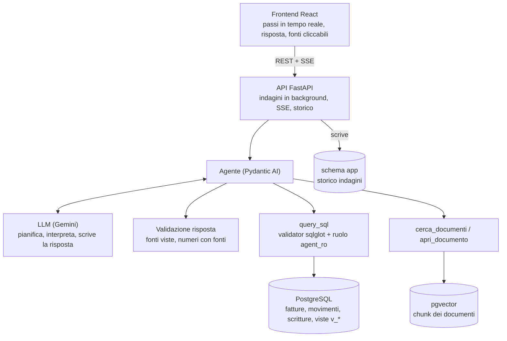

# Agentic Financial Investigation

Un agente AI che indaga i dati economici di un'azienda combinando **analisi SQL deterministica** e **ricerca nei documenti** per individuare e spiegare le variazioni rilevanti, citando le fonti e dichiarando quando una causa non è documentata.

<!-- TODO: aggiungere screenshot/GIF in docs/img/ e inserirli qui, ad es. 
     Scena consigliata: "Perché il margine è diminuito ad agosto?" → passi dell'indagine → risposta con fonti. -->

[Esempio](#esempio-di-indagine) · [Perché è un agente](#perché-un-agente-e-non-un-chatbot-rag) · [Architettura](#architettura) · [Scelte di progetto](#scelte-di-progetto) · [Incertezza](#quando-le-prove-non-ci-sono) · [Valutazione](#valutazione) · [Avvio locale](#avvio-in-locale)

Prototipo end-to-end funzionante: database, RAG, agente, API con streaming, interfaccia web e harness di valutazione. I dati sono sintetici.

## Perché l'ho costruito

Le informazioni economiche di un'azienda sono sparse tra dati strutturati (fatture, movimenti bancari, scritture contabili) e documenti (contratti, email, lettere, verbali). Capire *perché* un numero è cambiato richiede di passare a mano da una fonte all'altra.

Il progetto esplora una domanda: **come può un agente investigare dati e documenti per aiutare un professionista a capire cosa sta succedendo, mantenendo deterministici i calcoli e verificabili le prove?**

Non sostituisce il commercialista e non automatizza la contabilità: prepara un'analisi preliminare che il professionista può controllare fonte per fonte.

## Esempio di indagine

Domanda: *«Perché i ricavi dell'ultimo trimestre sono calati rispetto al precedente?»*
(output reale di una esecuzione, riportato dal [report pubblico di eval](eval/reports/20261007-173331.md), troncato)

```
Domanda
  ↓
v_margine_mensile                → andamento mensile di ricavi, costi, margine
  ↓
v_economico_mensile (Q3 vs Q4)   → confronto per conto di ricavo
  ↓
SUM(ricavi) per trimestre        → totali calcolati dal database
  ↓
fatture per cliente, Q3 vs Q4    → il calo si concentra su un cliente (CLI-001)
  ↓
cerca_documenti                  → comunicazione del cliente + contratto CTR-008
  ↓
Risposta validata (numeri + fonti)
```

> **Fatti (da SQL):** i ricavi sono scesi da € 270.300,00 (Q3 2025) a € 226.500,00 (Q4 2025), **-€ 43.800,00**.
> **Causa documentata:** Barilli Logistica (CLI-001) ha comunicato il 15/09/2025 l'internalizzazione dello sviluppo applicativo dal 1° ottobre, in base all'accordo quadro **CTR-008**; il fatturato mensile del cliente passa da circa € 28.000 a € 12.000.
> **Confidenza:** alta · **Fonti:** CTR-008 e le fatture/scritture restituite dalle query.

Ogni cifra viene dalla query che l'ha prodotta; ogni fonte è un ID apribile nella UI (fattura, movimento, contratto, email, ...). L'interfaccia mostra i passi in tempo reale: query SQL eseguite, documenti cercati e aperti, eventuali risposte scartate dal controllo sulle fonti.

Onestà sul risultato: in quel run la valutazione automatica ha dato **ko** su questa domanda (fonti attese citate 5/5, ma solo 2 dei 19 valori numerici attesi ritrovati). Il report completo, con i fallimenti, è nella sezione [Valutazione](#valutazione).

## Perché un agente e non un chatbot RAG

Un chatbot RAG fa sempre lo stesso percorso:

```
Domanda → ricerca vettoriale → LLM → risposta
```

Qui il percorso dipende da ciò che l'indagine scopre:

```
Domanda
   ↓
Agente (LLM con tool)
   ├── query_sql          metriche, confronti tra periodi, analisi di fatture e movimenti
   ├── cerca_documenti    ricerca semantica con filtri (tipo, periodo, fornitore, cliente)
   └── apri_documento     lettura del documento completo
   ↓
Risposta strutturata: numeri + fonti + confidenza + limiti
```

Prima confronta i periodi, poi individua la voce responsabile, poi *decide* cosa cercare nei documenti in base a ciò che ha trovato (un cliente, un fornitore, un intervallo di date). Una domanda sul contratto di un fornitore non passa dai confronti mensili; una sul margine sì. Un loop di tool con un limite di richieste per domanda (default 25) gestisce entrambi i casi.

## Architettura



- I **numeri** vengono solo da PostgreSQL (tra cui le viste `v_economico`, `v_economico_mensile`, `v_margine_mensile` che definiscono ricavi, costi e margine per competenza).
- Il **RAG** serve a recuperare documenti e contesto, non a produrre cifre.
- L'**LLM** orchestra e interpreta; non calcola.
- L'agente è **read-only**: si collega con un ruolo che non ha accesso in scrittura ai dati contabili. L'unico dato che l'applicazione scrive è lo storico delle indagini, in uno schema separato (`app`) invisibile all'agente.

## Scelte di progetto

**SQL + RAG.** Le metriche si calcolano in modo deterministico da dati strutturati, non si generano con un LLM. SQL risponde a «cosa è successo?», i documenti aiutano a rispondere a «perché potrebbe essere successo?». Il prompt vieta il calcolo a mente: differenze e percentuali devono stare nella query.

**Un agente.** Domande diverse richiedono percorsi diversi (solo metriche, confronto tra periodi, ricerca documentale, tutto insieme) e il passo successivo dipende dal risultato del precedente. Una pipeline fissa o sovra-recupera o salta pezzi.

**Sola lettura, a più livelli.** La barriera vera è il database: ruolo `agent_ro` con `statement_timeout` di 10 s e `SET TRANSACTION READ ONLY` per ogni query. Sopra c'è un validator con sqlglot (una sola SELECT, niente scritture, funzioni pericolose bloccate, solo relazioni note) che dà al modello errori chiari invece di errori del database. Investigare e modificare i dati sono responsabilità separate.

**Prove verificabili.** Le conclusioni sono tracciabili a ID di fonti (`FATT-*`, `MOV-*`, `SCR-*`, `CTR-*`, `DOC-*`, ...). L'obiettivo non è «l'AI dice X» ma «l'AI ha trovato X, ed ecco cosa ha usato». Il vincolo non è solo nel prompt: un *output validator* rifiuta la risposta (e fa riprovare il modello) se cita un ID mai comparso nei risultati dei tool, se un numero non ha fonti, o se dichiara `causa_documentata=true` senza almeno un `DOC-*`/`CTR-*`.

**Trasparenza.** Query, ricerche e documenti aperti sono eventi visibili (tool call, tool result, risposte scartate), salvati e rivedibili.

## Quando le prove non ci sono

Il sistema non assume che ogni anomalia abbia una spiegazione.

```
Variazione rilevata → documento pertinente trovato → conclusione + fonte
                       (causa_documentata = true)

Variazione rilevata → nessun documento sopra la soglia di pertinenza
                    → la causa viene dichiarata non documentata
                       (causa_documentata = false, spiegazione in "limiti")
```

Esempio reale (stesso report): picco dei costi di trasferta a novembre 2025. L'agente trova nei dati l'origine contabile (quattro fatture di biglietti ferroviari sul conto 64.02, € 1.750 contro una media di € 550), poi risponde che **non esiste alcun documento che motivi le trasferte** e imposta `causa_documentata=false`, con la spiegazione in `limiti`.

I meccanismi: il tool `cerca_documenti` restituisce solo chunk entro una soglia di distanza coseno e, se non ce ne sono, dice esplicitamente di non inventare una causa; il prompt tratta la causa non documentata come una risposta legittima; il validator impedisce di dichiararla documentata senza un documento. Non è una garanzia di assenza di allucinazioni: riduce il rischio e rende gli errori controllabili.

## Valutazione

Un harness (`python -m agentic_rag.eval`) esegue un set di domande con lo stesso agente dell'API e le confronta con un ground truth riservato:

- **Dataset:** 12 domande su 6 «storie» (eventi sepolti nei dati: cambi di listino, perdita di un cliente, picchi di spesa, ...) più domande fuori storia, in quattro modalità: normale, *onesta* (causa non documentata), *non rispondibile* (i dati non lo permettono), *regolare* (nessuna anomalia).
- **Ground truth:** per ciascuna domanda, le fonti che un'indagine corretta deve citare, la query SQL i cui valori sono la risposta numerica attesa, e il comportamento atteso nei casi onesti/non rispondibili. La query attesa gira su un SQLite costruito da `data/csv`, indipendente dall'agente.
- **Successo:** fonti attese citate, numeri attesi ritrovati nella risposta, nessuna fonte citata mai vista, comportamento corretto nei casi onesti/non rispondibili; opzionalmente un giudice LLM sulla causa.
- **Separazione:** il ground truth non è mai accessibile all'agente né a chi lo sviluppa. Prompt, soglie e tool non vanno ritoccati guardando il test set.

Ultima batteria completa ([report pubblico](eval/reports/20261007-173331.md), `gemini-3.5-flash-lite`, senza giudice):

| | Domande | ok | ko |
|---|---|---|---|
| Totale | 12 | 5 | 7 |
| modalità *onesta* (causa non documentata) | 1 | 1 | 0 |
| modalità *non rispondibile* | 1 | 1 | 0 |
| modalità normale | 9 | 3 | 6 |
| modalità *regolare* | 1 | 0 | 1 |

In media ~9 richieste al modello per domanda. La valutazione è **preliminare**: 12 domande sono un segnale, non una misura statistica; gli esiti sono euristiche (soglie in `eval/valutazione.py`) che possono penalizzare risposte corrette ma formulate diversamente. I ko sono reali e documentati nei report: per esempio, sul margine di agosto l'agente attribuisce il calo dei ricavi a una generica stagionalità senza trovare la causa. I risultati vanno letti così.

## Stack

| | |
|---|---|
| Backend | Python 3.13, FastAPI, Pydantic AI |
| Database | PostgreSQL 17 |
| Vettori | pgvector (embedding Gemini) |
| LLM | Gemini (`gemini-3.5-flash-lite` di default, configurabile) |
| SQL validation | sqlglot |
| Frontend | React 19, TypeScript, Vite |
| Osservabilità | Logfire (opzionale) |
| Deploy locale | Docker Compose |

## Struttura del progetto

```
src/agentic_rag/
  agent/    agente, tool, prompt, validazione SQL e risposta
  rag/      chunking, embedding, indicizzazione, ricerca
  db/       schema, viste, ruoli, caricamento dati
  api/      indagini in background, streaming SSE, apertura delle fonti
  eval/     harness di valutazione
frontend/   UI React
data/       CSV contabili e documenti sintetici (contratti, email, lettere, verbali)
eval/       report pubblici (il ground truth è fuori da git/da questo documento)
tests/      unit e integrazione
```

## Avvio in locale

Requisiti: Docker, Python 3.13+, Node.js, una chiave Gemini (`GOOGLE_API_KEY`).

```bash
cp .env.example .env                    # imposta GOOGLE_API_KEY; cambia le password se vuoi
docker compose up -d db                 # Postgres + pgvector
pip install -e ".[dev]"
python -m agentic_rag.db.init --reset   # ruoli, schema, viste, caricamento dati
python -m agentic_rag.rag.indexer       # chunking + embedding dei documenti (usa la chiave Gemini)
docker compose up                       # DB + API (:8000) + UI (:5173), con hot-reload
```

Apri http://localhost:5173. Senza container: `uvicorn agentic_rag.api.app:app` (un solo worker: le indagini vivono nel processo) e `cd frontend && npm install && npm run dev`.

Dalla riga di comando:

```bash
python -m agentic_rag.agent "Perché il margine è diminuito ad agosto?"
```

<details>
<summary>Ruoli del database, variabili d'ambiente, API</summary>

Ruoli: `postgres` (solo bootstrap), `agentic_owner` (DDL e caricamento), `agent_ro` (sola lettura, usato dall'agente), `app_rw` (scrive lo storico nello schema `app`, senza accesso a `public`). Su un database già inizializzato: `python -m agentic_rag.db.init --app-only`.

Variabili principali: `GOOGLE_API_KEY`, `AGENT_MODEL`, `AGENT_MAX_REQUESTS` (25), `DATABASE_URL*`, `CORS_ORIGINS`, `MAX_INDAGINI_CONCORRENTI` (3), `LOGFIRE_TOKEN`. Vedi `.env.example`. Con Docker l'API raggiunge il DB come `db` (`DATABASE_URL_APP_DOCKER` / `DATABASE_URL_AGENT_DOCKER`, da impostare solo se hai cambiato le password).

| Endpoint | |
|---|---|
| `POST /indagini` `{"domanda": "..."}` | avvia, `202 {id, stato}` |
| `GET /indagini?limit&before` | elenco |
| `GET /indagini/{id}` | stato, risposta, errore, utilizzo |
| `GET /indagini/{id}/eventi` | SSE: replay + coda live (`Last-Event-ID` / `?dopo=<seq>`) |
| `POST /indagini/{id}/stop` | ferma l'indagine |
| `GET /fonti/{id}` | apre una fonte citata (campi, tabelle collegate, testo, collegamenti), sola lettura |

Eventi SSE: `tool_call`, `tool_result` (solo conteggi e ID, mai le righe), `tool_retry`, `risposta_scartata`, e i terminali `risposta`, `errore`, `interrotta`. Un'indagine continua anche se si chiude la pagina; con un riavvio del server quelle in corso diventano `interrotta`.

</details>

<details>
<summary>Test e valutazione</summary>

```bash
pytest                                  # unit
pytest -m integration                   # richiede il database
cd frontend && npm test && npm run build

python -m agentic_rag.eval --dry-run            # valida il ground truth senza chiamare il modello
python -m agentic_rag.eval --pause 10           # batteria completa
python -m agentic_rag.eval --ids 1,4 --judge    # alcune domande, con giudice LLM sulla causa
```

Opzioni: `--ids`, `--storia`, `--modalita`, `--model`, `--judge-model`, `--pause`, `--timeout`, `--gt`, `--out`. Due report: pubblico in `eval/reports/` e privato (con ground truth) in `eval/reports/private/`, ignorato da git.

</details>

## Limiti

- Dati **sintetici**: un'azienda inventata di piccole dimensioni (~300 fatture, ~1.700 scritture, una sessantina di documenti), costruita per contenere eventi da trovare.
- **Prototipo**, non software contabile di produzione; nessuna integrazione con gestionali reali.
- Documenti in Markdown; nessun parsing di PDF, scansioni o allegati.
- Il ragionamento dipende dall'LLM: la stessa domanda può prendere percorsi diversi e le conclusioni non sono deterministiche (i numeri sì, perché vengono dalle query).
- Valutazione piccola e preliminare; la soglia di pertinenza del RAG è calibrata a mano.
- Nessuna autenticazione né isolamento tra clienti.

## Sviluppi possibili

- Connettori a gestionali/ERP reali al posto dei CSV.
- Revisione umana (human-in-the-loop) con conferma o rifiuto delle conclusioni.
- Valutazione più ampia, con più esecuzioni per domanda per misurarne la varianza.
- Ranking delle prove migliore (re-ranking, ricerca ibrida lessicale + vettoriale) e soglie di pertinenza apprese.
- Autenticazione e isolamento per tenant.
- Altri formati di documento (PDF, scansioni con OCR).

## Filosofia

Il progetto esplora come integrare un agente AI in un flusso di lavoro professionale: il modello indaga e collega le informazioni, sistemi deterministici forniscono i dati e i calcoli, e il professionista resta responsabile della verifica e delle decisioni.
